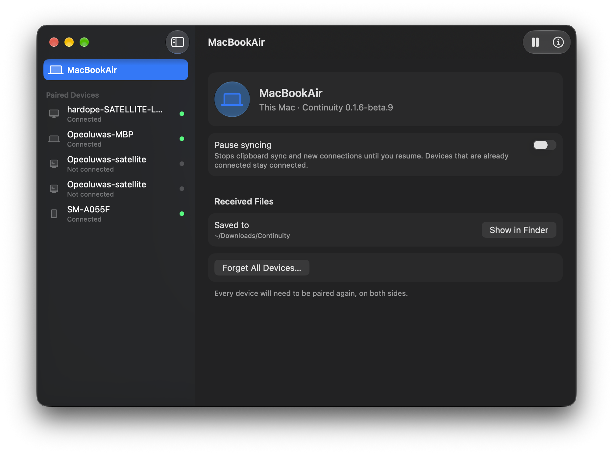
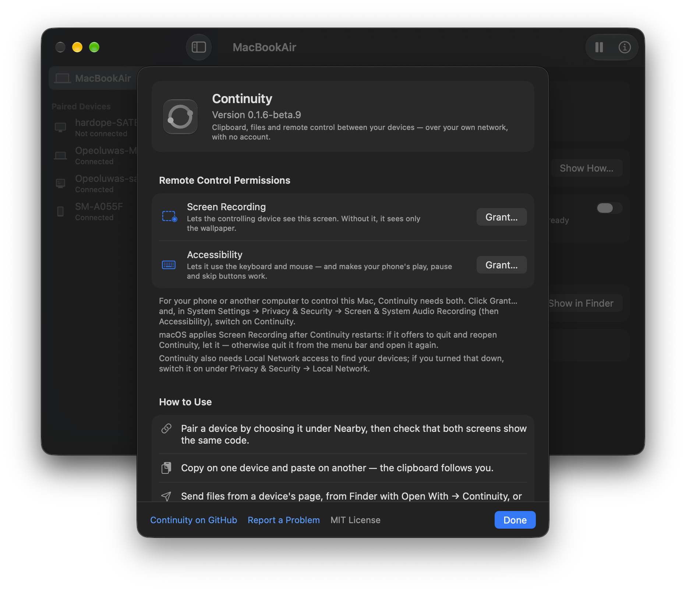
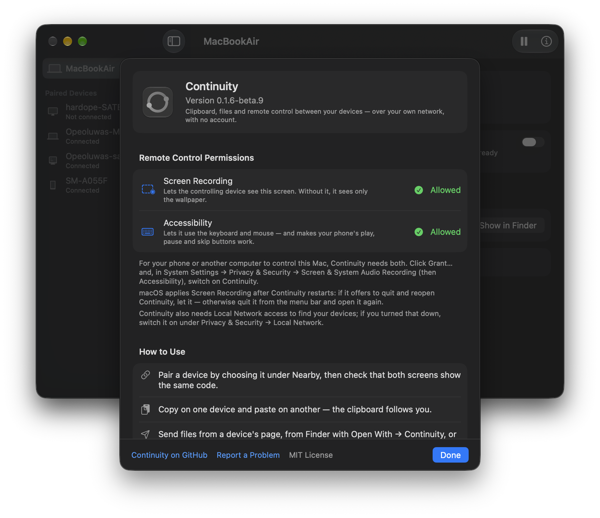
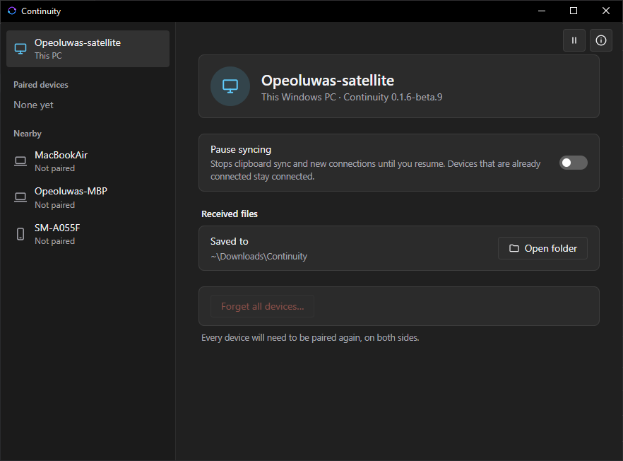
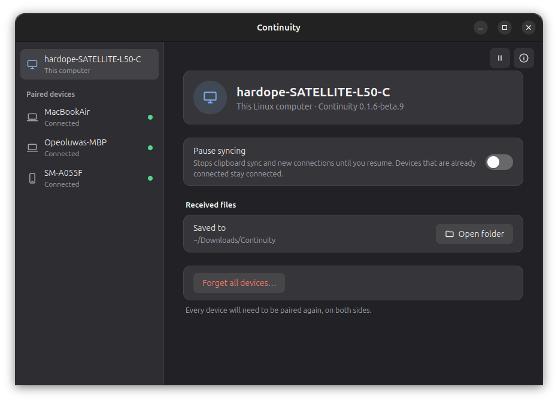
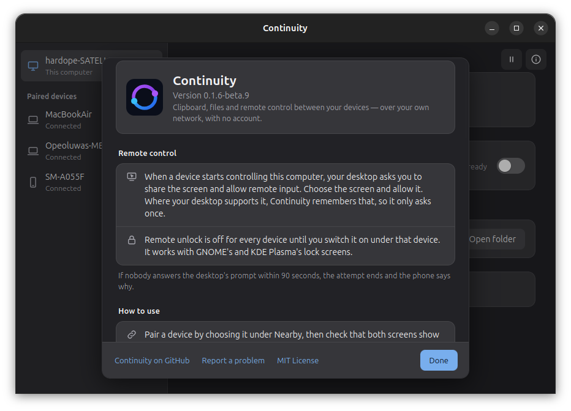
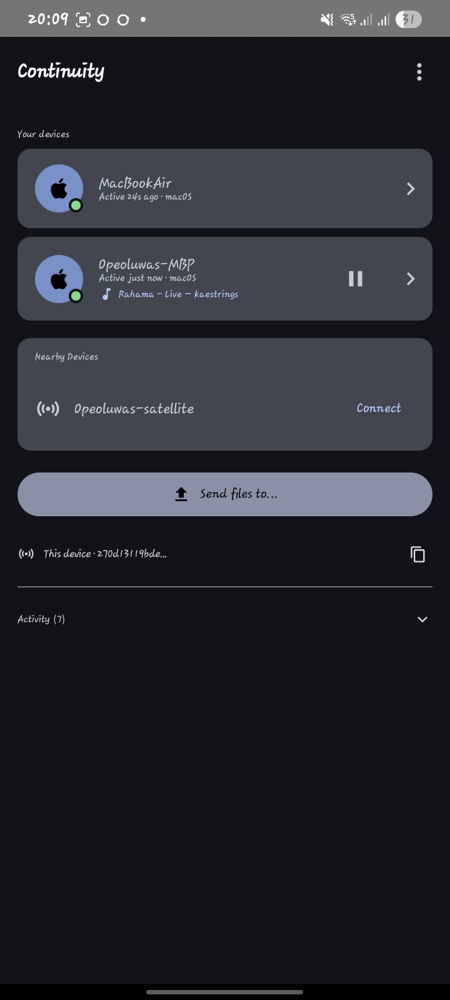
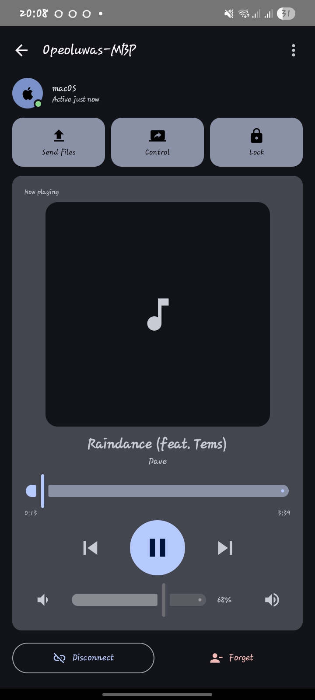

<p align="center">
  
</p>

<h1 align="center">Continuity</h1>

<p align="center">
  Clipboard, files, media and full remote control across macOS, Windows, Linux and Android —<br>
  directly over your own network. No cloud, no account.
</p>

<p align="center">
  <a href="https://github.com/hardope/continuity/releases/latest"></a>
  <a href="https://github.com/hardope/continuity/actions/workflows/release.yml"></a>
  <a href="LICENSE"></a>
</p>

Continuity fills the gap Apple's own Continuity leaves at the edge of its ecosystem. Copy on one device and paste on another, send files, control what's playing on a computer from your phone, or take over a computer's keyboard, mouse and screen — between any mix of Macs, PCs, Linux machines and Android phones. Every paired device talks directly to every other one on the local network: nothing passes through a server, and there's no account to make.

## Screenshots

**macOS** — the settings window, and its ⓘ panel before and after granting what remote control needs:

<p align="center">
  
</p>
<table>
  <tr>
    <td></td>
    <td></td>
  </tr>
</table>

**Windows** and **Linux** — the same window in the system's own web view, styled for each:

<table>
  <tr>
    <td></td>
    <td></td>
  </tr>
  <tr>
    <td align="center">Windows</td>
    <td align="center">Linux (Ubuntu)</td>
  </tr>
</table>
<p align="center">
  
</p>

**Android** — your devices, and one device's page: its actions, and a player for whatever it's playing, all on one screen:

<p align="center">
  
  &nbsp;&nbsp;
  
</p>

## What it does

- **Clipboard** — copy text on one device and paste it on any other; each copy goes to every connected device.
- **Files** — send from a device's page (in the settings window or on your phone), from the tray menu, from your file manager — right-click → Send to on Windows, a Send with Continuity entry in Files, Dolphin and Nemo on Linux, Open With → Continuity in Finder — or from any Android app's share sheet. They arrive in `Downloads/Continuity`.
- **Media** — see what's playing on a computer and control it from your phone: play and pause, previous and next, seek, volume, with the artwork, title and artist.
- **Remote control** — use a computer's keyboard and mouse, and see its screen, from your phone. The computer asks you first, unless you've told it to trust that device.
- **Lock and unlock** — lock any of your computers from your phone. A Linux computer can be unlocked too, once you've allowed that phone to.
- **A settings window** — tray menu → **Settings…** on every desktop: paired and nearby devices, pairing, sending files, what each device is allowed to do, pausing sync, and an **ⓘ** panel with what Continuity has done since it started and what remote control needs on that computer.
- **Private by design** — devices find each other with mDNS and talk directly over TLS 1.3 with mutual authentication. Pairing is trust-on-first-use, confirmed by comparing a 6-digit code on both screens — the same trust model as SSH host keys.

## Download

Get the file for each device from the [latest release](https://github.com/hardope/continuity/releases/latest):

| | File | Install | Needs |
|---|---|---|---|
| **macOS** | `continuity-macos.dmg` | Open it and drag Continuity to Applications. | macOS 11 or later, Apple silicon or Intel. The settings window needs macOS 12. |
| **Windows** | `continuity-windows-setup.exe` | Run it: Start menu entry, starts at sign-in, uninstalls cleanly. | Windows 10 or 11, 64-bit. On Windows 10 the settings window needs the [WebView2 Runtime](https://go.microsoft.com/fwlink/p/?LinkId=2124703) (Windows 11 has it). |
| **Linux** | `continuity-linux.deb` | `sudo apt install ./continuity-linux.deb` (it installs the libraries it needs), then run `continuityd`. | Ubuntu 24.04 or Debian 13 or later, x86-64. |
| **Android** | `continuity-android.apk` | Open it on the phone, allowing installs from unknown sources. | Android 8 or later. |

Nothing is signed with a paid certificate yet, so expect one warning the first time. On **macOS** the app is ad-hoc signed but not notarized: right-click Continuity → **Open** (on macOS 15 and later: System Settings → Privacy & Security → **Open Anyway**). On **Windows**, SmartScreen: **More info** → **Run anyway**.

Continuity lives in the menu bar or system tray. Windows 11 often hides a new tray icon behind the **^** overflow — drag it onto the taskbar to keep it in view. On GNOME the tray icon needs AppIndicator support: Ubuntu has it built in; elsewhere, install the AppIndicator extension.

## Getting started

1. Install Continuity on each device and put them on the same network.
2. On a computer, open the tray icon → **Settings…**; on the phone, open the app.
3. Pick the other device under **Nearby** and pair. Both screens show a 6-digit code — confirm on each only if they match. Pairing is always a deliberate step: nothing pairs on its own.
4. From then on, paired devices reconnect by themselves. Copy something to try the clipboard, or open a device's page to send files, control its music, lock it or take over its screen.

## What remote control needs

- **macOS** — two permissions: **Screen Recording** (otherwise the phone sees only the wallpaper) and **Accessibility** (keyboard and mouse, and your phone's play, pause and skip buttons). **Settings…** → **ⓘ** shows whether each is on, with a **Grant…** button that asks for it and opens the right page of System Settings. macOS applies Screen Recording after Continuity restarts. On macOS 15 and later, also allow Local Network access when asked, or Continuity can't find your devices.
- **Windows** — nothing to set up. Windows doesn't let one app type into another running as administrator, or into a UAC prompt, so those stay view-only. If your devices can't find the PC, allow Continuity through Windows Defender Firewall on private networks.
- **Linux** — through the desktop's screen-sharing portal (GNOME and KDE, including Wayland). The first time, the desktop asks you to share the screen: choose it and allow it, and where the desktop supports it, it remembers. Remote unlock works with GNOME's and KDE Plasma's lock screens (some standalone lockers, like swaylock, ignore it) and is off until you allow it for a device.
- **Every computer** asks before a device takes control, unless you've switched on **Control this computer without asking** for that device in the settings window.

## Status

0.1.6 is the current release. Every platform is built and tested in CI on its own runner; this is what has also been confirmed on real devices so far:

| | Confirmed on real devices | Built and tested, not yet confirmed |
|---|---|---|
| Pairing and connections | macOS, Windows, Linux, Android | |
| Clipboard | macOS, Windows, Android | Linux |
| Files | macOS, Windows | Linux, Android |
| Media control from a phone | controlling a Mac | controlling Windows and Linux |
| Remote control from a phone | Windows; a Mac's screen | clicks and typing on a Mac; Linux |
| Remote lock and unlock | | lock on macOS and Windows; lock and unlock on Linux |
| Settings window | macOS (Apple silicon), Windows, Linux (Ubuntu) | macOS 12; the Linux file picker fixed in 0.1.6 |
| Android device page | fits one screen on a Galaxy A05 | |
| Sharing (share sheet, file managers) | | Android, Windows, Linux, macOS |
| iOS app | | doesn't build yet — see [`docs/ios-build.md`](docs/ios-build.md) |

- The Mac app is universal: it runs on Apple silicon (an M1) and on Intel (a Mac on macOS 12).
- Android only sends its clipboard while the app is open: Android 10 and later don't let apps read the clipboard in the background.
- Controlling one computer from another is built but hidden from the tray menu for now: the viewer froze the controlling app in testing.

The full write-up — protocol, security model, every bug worth remembering and what's still unverified — is in [`docs/protocol.md`](docs/protocol.md).

## How it works

- **Discovery**: mDNS/DNS-SD (`_continuity._tcp`) on the local network.
- **Transport**: TLS 1.3, mutual certificate auth tied to each device's Ed25519 identity — no CA, no cloud.
- **Pairing**: trust-on-first-use with a 6-digit confirmation code shown on both devices; only trusted devices can connect at all.
- **Sync engine**: one shared Rust core (`continuity-daemon`) drives every app — the desktop tray app, the CLI, and (via UniFFI) the Android and iOS apps all sit on the same discovery, pairing and sync logic rather than reimplementing it per platform.
- **Remote control**: a separate, explicit consent step per session (not implied by pairing) starts keyboard and mouse relay over the existing connection, and a dedicated connection for the screen stream — kept apart on purpose, so a continuous frame stream can never delay a clipboard update or a keepalive ping.

## Building

**Desktop** (macOS, Windows, Linux), with stable Rust:

```bash
cargo build --release -p continuityd
```

On Linux, install the development packages first — the list is in [`.github/scripts/install-linux-deps.sh`](.github/scripts/install-linux-deps.sh). `cargo build -p continuityd --no-default-features` builds a "lite" desktop app with remote control compiled out entirely. `continuityctl`, a command-line tool for testing, isn't released; build it with `-p continuityctl`.

**macOS settings window** (needs Xcode): `apps/macos/ContinuitySettings/build-app.sh <output dir>`; CI puts it inside Continuity.app.

**Android**: see [`docs/android-build.md`](docs/android-build.md). **iOS**: see [`docs/ios-build.md`](docs/ios-build.md) — it doesn't build cleanly yet.

**Tests**: `cargo test --workspace --lib --bins` (unit tests), `cargo test -p continuity-daemon --tests` (two real engines over loopback mDNS), and `swift test` in `apps/macos/ContinuitySettings`.

CI ([`.github/workflows/release.yml`](.github/workflows/release.yml)) runs one lane per platform — its tests, then its build — on that platform's own runner for every `v*` tag, and publishes the release only when every lane passes. It can also be run by hand from [Actions](https://github.com/hardope/continuity/actions/workflows/release.yml), which builds the same files from `master` without making a release.

```
core/            Rust workspace — protocol, crypto, networking, the shared
                 sync engine, the desktop app (continuityd), the CLI
                 (continuityctl), and the mobile FFI layer (continuity-ffi)
apps/android/    Android app (Kotlin, Jetpack Compose)
apps/macos/      The macOS settings window (SwiftUI)
apps/ios/        iOS app (Swift, SwiftUI) + Share Extension
installers/      macOS app bundle, Windows installer, Linux desktop entry
assets/          Brand mark source (assets/logo.svg)
docs/            Protocol and security write-up, build notes, screenshots
```

## License

MIT — see [`LICENSE`](LICENSE).
